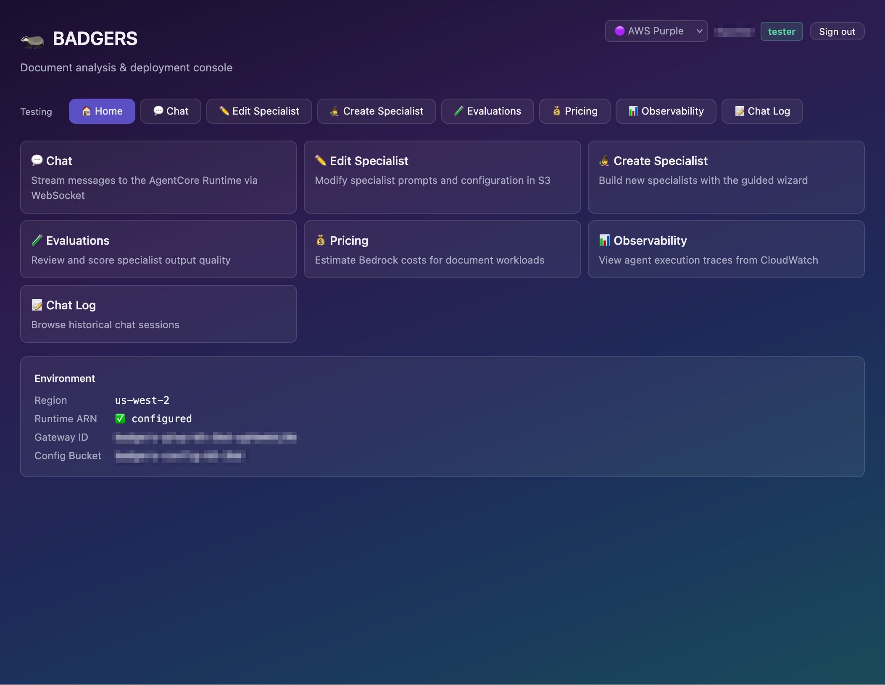
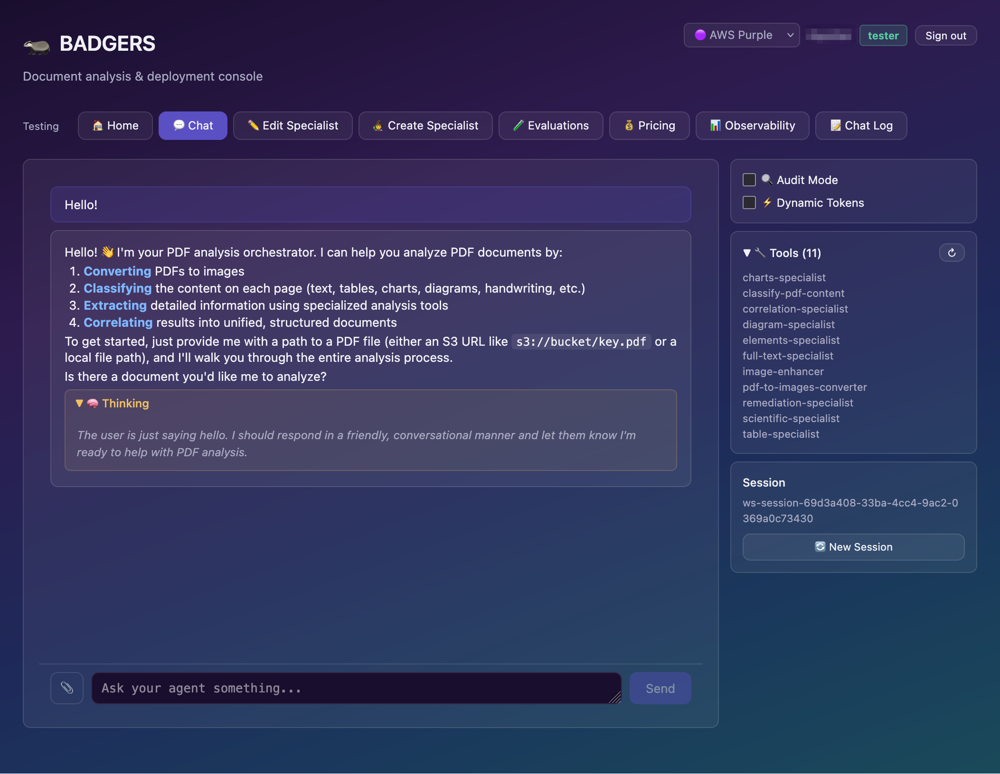
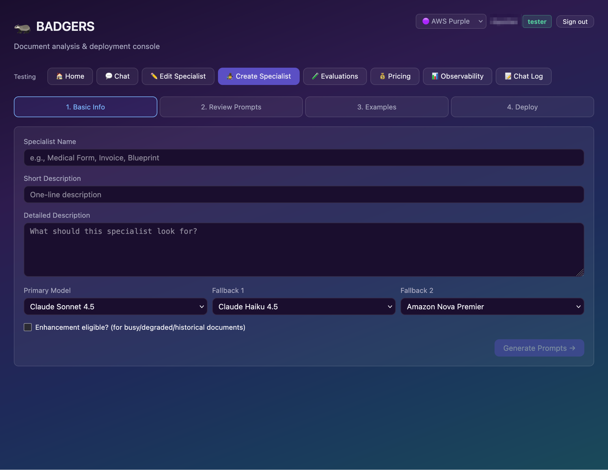
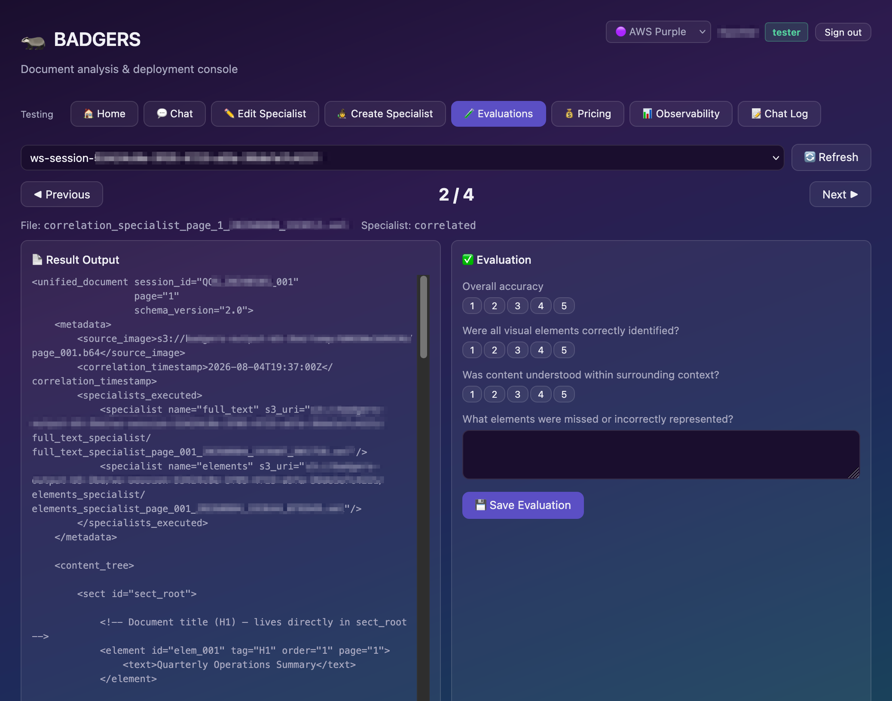
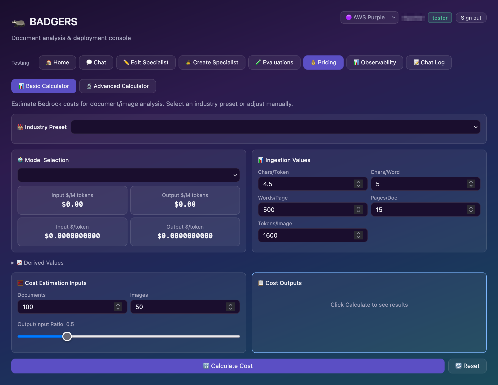
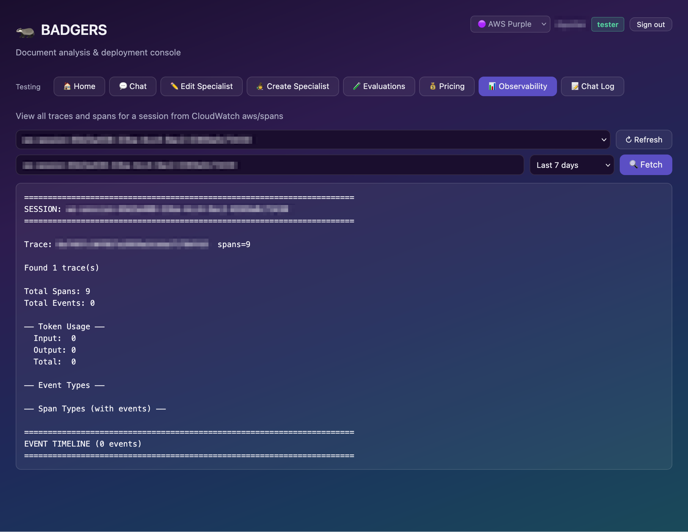
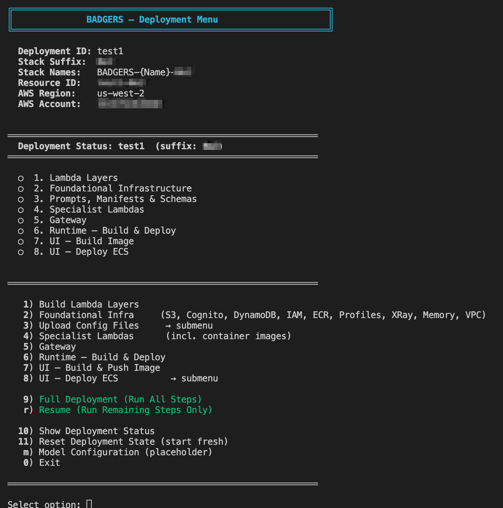

> [!WARNING]
> 🚧 **This repository is under active development.** Watch the repo, monitor branches and issues, and check the [Changelog](CHANGELOG.md) for the latest updates.

<sub>🧭 **Navigation:**</sub><br>
<sub>🔵 **Home** | [Vision LLM Theory](VISION_LLM_THEORY_README.md) | [UI](ui/UI_README.md) | [Deployment](deployment/DEPLOYMENT_README.md) | [CDK Stacks](deployment/stacks/STACKS_README.md) | [Runtime](deployment/runtime/RUNTIME_README.md) | [S3 Files](deployment/s3_files/S3_FILES_README.md) | [Lambda Specialists](deployment/lambdas/LAMBDA_SPECIALISTS.md) | [Prompting System](deployment/s3_files/prompts/PROMPTING_SYSTEM_README.md)</sub>

---

# 🦡 BADGERS v4.0 as of August 2026

**Broad Agentic Document Generative Extraction & Recognition System**

BADGERS transforms document processing through vision-enabled AI and deep layout analysis. Unlike traditional text extraction tools, BADGERS understands document structure and meaning by recognizing visual hierarchies, reading patterns, and contextual relationships between elements.

## 🤔 Why BADGERS?

Traditional document processing tools extract text but lose context. They can't distinguish a header from body text, understand table relationships, or recognize that a diagram explains the adjacent paragraph. BADGERS solves this by:

- 🏗️ **Preserving semantic structure** - Maintains document hierarchy and element relationships
- 👁️ **Understanding visual context** - Recognizes how layout conveys meaning
- 📚 **Processing diverse content** - Handles 21+ element types from handwriting to equations
- 🤖 **Automating complex workflows** - Orchestrates multiple specialized specialists via an AI agent

Use cases: research acceleration, compliance automation, content management, accessibility remediation.

## 📸 Screenshots

A single React + Express app is both the testing workbench and the deployment/ops console — the same code runs locally via `npm run dev` or on ECS behind Cognito OIDC. Tabs are role-gated: the **Testing** row below is visible to all users, while an admin-only **Deploy** row (Stacks, Specialists, S3 Configs, Deploy Tags) is not pictured here. See the [UI README](ui/UI_README.md) for the full tab and role breakdown.

### Testing tabs

| Home                                                                                                                 | Chat                                                                                                                                                    |
| -------------------------------------------------------------------------------------------------------------------- | ------------------------------------------------------------------------------------------------------------------------------------------------------- |
|                                                                    |                                                                                                       |
| Landing view with per-page navigation and the resolved environment (region, runtime ARN, gateway ID, config bucket). | Streams messages to the AgentCore Runtime over WebSocket, with extended-thinking blocks, the live gateway tool list, and audit / dynamic-token toggles. |

| Create Specialist                                                                                                     | Evaluations                                                                                                                |
| --------------------------------------------------------------------------------------------------------------------- | -------------------------------------------------------------------------------------------------------------------------- |
|                                           |                                                            |
| Four-step wizard — basic info, generated prompt review, examples, deploy — including primary model and two fallbacks. | Pages through a session's specialist output and scores accuracy, element identification, and contextual understanding 1–5. |

| Pricing                                                                                                                | Observability                                                                                                           |
| ---------------------------------------------------------------------------------------------------------------------- | ----------------------------------------------------------------------------------------------------------------------- |
|                                                          |                                               |
| Basic and advanced Bedrock cost calculators with industry presets, per-model token pricing, and ingestion assumptions. | Pulls traces and spans for a session from the CloudWatch `aws/spans` log group, with token usage and an event timeline. |

### Deployment CLI



The deployment menu tracks the eight ordered steps — Lambda layers, foundational infrastructure, prompts/manifests/schemas, specialist Lambdas, gateway, runtime, UI image, UI ECS service — per deployment ID and stack suffix. Steps can be run individually, all at once, or resumed from wherever the last run stopped.

## ⚙️ How It Works

```
┌─────────────────────────────────────────────────────────────────────────────┐
│                           AgentCore Runtime                                 │
│   ┌─────────────────────────────────────────────────────────────────────┐   │
│   │  PDF Analysis Agent (Strands)                                       │   │
│   │  - Claude Sonnet 4.5 with Extended Thinking                         │   │
│   │  - Session state management                                         │   │
│   │  - MCP tool orchestration                                           │   │
│   └─────────────────────────────────────────────────────────────────────┘   │
└─────────────────────────────────────────────────────────────────────────────┘
                                      │
                                      ▼
┌─────────────────────────────────────────────────────────────────────────────┐
│                           AgentCore Gateway                                 │
│   - MCP Protocol (2025-03-26)                                               │
│   - Cognito JWT Authentication                                              │
│   - Semantic tool search                                                    │
└─────────────────────────────────────────────────────────────────────────────┘
                                      │
                   ┌──────────────────┼──────────────────┐
                   │                  │                  │
                   ▼                  ▼                  ▼
            ┌─────────────┐    ┌─────────────┐    ┌─────────────┐
            │   Lambda    │    │   Lambda    │    │   Lambda    │
            │ Specialist  │    │ Specialist  │    │ Specialist  │
            │ (26 tools)  │    │             │    │             │
            └─────────────┘    └─────────────┘    └─────────────┘
                   │                  │                  │
                   └──────────────────┼──────────────────┘
                                      ▼
                               ┌─────────────┐
                               │   Bedrock   │
                               │   Claude    │
                               └─────────────┘
```

1. 📄 **User submits a document** with analysis instructions
2. 🧠 **Strands Agent** (running in AgentCore Runtime) interprets the request
3. 🔧 **Agent selects tools** from a library of specialists via MCP Gateway
4. 📋 **Agent opens a job** on the first specialist call, tagging every invocation in the run with the job and document it belongs to
5. ⚡ **Lambda specialists** (standardized and domain-specific functions, including container-based) process document elements using Claude vision models, each recording its own outcome
6. 📊 **Results aggregate** with preserved structure and semantic relationships

## 🛠️ Tech Stack

| Component          | Technology                                                             |
| ------------------ | ---------------------------------------------------------------------- |
| 🤖 Agent Framework  | [Strands Agents](https://github.com/strands-agents/strands-agents)     |
| 🏠 Agent Hosting    | Amazon Bedrock AgentCore Runtime                                       |
| 🚪 Tool Gateway     | Amazon Bedrock AgentCore Gateway (MCP Protocol)                        |
| 🧠 Foundation Model | Claude Sonnet 4.5 (via Amazon Bedrock)                                 |
| ⚡ Compute          | AWS Lambda (modular specialist functions, including container-based)   |
| 📦 Storage          | Amazon S3 (configs, prompts, outputs)                                  |
| 📋 Job Tracking     | Amazon DynamoDB (document → job → subtask state)                       |
| 🖥️ UI Hosting       | Amazon ECS Express Gateway service (in a VPC)                          |
| 🔐 Auth             | Amazon Cognito (OIDC + PKCE for the UI, OAuth 2.0 M2M for the Gateway) |
| 🏗️ IaC              | AWS CDK (Python)                                                       |
| 📈 Observability    | CloudWatch Logs, X-Ray Transaction Search                              |
| 📊 Cost Tracking    | Bedrock Application Inference Profiles                                 |

## 🔬 Specialists

| Specialist                             | Purpose                                                                                    |
| -------------------------------------- | ------------------------------------------------------------------------------------------ |
| 📸 `pdf_to_images_converter`            | Convert PDF pages to images                                                                |
| 🏷️ `classify_pdf_content`               | Classify document content type                                                             |
| 📝 `full_text_specialist`               | Extract all text content                                                                   |
| 📊 `table_specialist`                   | Extract and structure tables                                                               |
| 📈 `charts_specialist`                  | Analyze charts and graphs                                                                  |
| 🔀 `diagram_specialist`                 | Process diagrams and flowcharts                                                            |
| 📐 `layout_specialist`                  | Document structure analysis                                                                |
| 🏥 `decision_tree_specialist`           | Medical/clinical document analysis                                                         |
| 🔬 `scientific_specialist`              | Scientific paper analysis                                                                  |
| ✍️ `handwriting_specialist`             | Handwritten text recognition                                                               |
| 🔢 `handwriting_math_specialist`        | Handwritten mathematical notation recognition                                              |
| 💻 `code_block_specialist`              | Extract code snippets                                                                      |
| 🗂️ `metadata_generic_specialist`        | Generic metadata extraction                                                                |
| 🗂️ `metadata_mads_specialist`           | MADS metadata format extraction                                                            |
| 🗂️ `metadata_mods_specialist`           | MODS metadata format extraction                                                            |
| 🔑 `keyword_topic_specialist`           | Extract keywords and topics                                                                |
| 🔧 `remediation_specialist`             | PDF accessibility remediation (container, content stream tagging + structure tree builder) |
| 📄 `page_specialist`                    | Single page content analysis                                                               |
| 🧱 `elements_specialist`                | Document element detection                                                                 |
| 🧱 `robust_elements_specialist`         | Enhanced element detection with fallbacks                                                  |
| 👁️ `general_visual_analysis_specialist` | General-purpose visual content analysis                                                    |
| ✏️ `editorial_specialist`               | Editorial content and markup analysis                                                      |
| 🗺️ `war_map_specialist`                 | Historical war map analysis                                                                |
| 🎓 `edu_transcript_specialist`          | Educational transcript analysis                                                            |
| 🔗 `correlation_specialist`             | Correlate multi-specialist results per page                                                |
| 🖼️ `image_enhancer`                     | Image enhancement and preprocessing                                                        |

## 🚀 Deployment

### Prerequisites

- ☁️ [AWS CLI](https://docs.aws.amazon.com/cli/latest/userguide/getting-started-install.html) configured with credentials
- 📦 [AWS CDK v2](https://docs.aws.amazon.com/cdk/v2/guide/getting_started.html) (`npm install -g aws-cdk`)
- 🐳 [Docker](https://docs.docker.com/get-started/get-docker/) (running)
- 🐍 [Python 3.12+](https://www.python.org/downloads/)
- ⚡ [uv](https://docs.astral.sh/uv/getting-started/installation/)

### Quick Start

```bash
./deploy.sh
```

That is the whole command. `deploy.sh` asks which deployment to work on — listing anything
it finds in `.deploy-state/`, or offering to start a new one — and then presents a menu.
It is resumable and every step is idempotent, so re-run it after a failure and it picks up
where it stopped.

> `DEPLOYMENT_ID` is **not** read from the environment. It is always chosen interactively,
> because a value left exported in your shell silently targets another deployment's stacks.

Pick option **9** for a full deployment, or **12** to run only what is still outstanding.
You can jump straight to one option — `./deploy.sh 6` — and the deployment is still chosen
interactively first.

The eight steps:

| #   | Step               | What it does                                                            |
| --- | ------------------ | ----------------------------------------------------------------------- |
| 1   | Lambda Layers      | foundation, PDF processing, Poppler/qpdf                                |
| 2   | Foundational Infra | S3, Cognito, DynamoDB, IAM, ECR, Inference Profiles, X-Ray, Memory, VPC |
| 3   | Upload Config      | prompts, manifests and schemas to the config bucket                     |
| 4   | Specialist Lambdas | container images, then the Lambda stack (26 specialists)                |
| 5   | Gateway            | AgentCore MCP Gateway, records the Gateway URL                          |
| 6   | Runtime            | builds and pushes the agent image, then deploys the Runtime             |
| 7   | UI — Build         | generates `ui/.env` from Cognito, builds the bundle and image           |
| 8   | UI — Deploy        | ECS Express Gateway service, forces the rollout, waits for it           |

Plus **9** full deployment, **12** resume, **10** status, **11** reset state (deletes
nothing in AWS), **0** exit.

Step 8 asks once whether the UI should be publicly reachable. That answer is fixed for the
life of the VPC — see
[Network exposure](deployment/DEPLOYMENT_README.md#network-exposure--asked-once-fixed-for-the-vpcs-lifetime).

For the full procedure, prerequisites in depth, and every environment variable, see the
[Deployment Guide](deployment/DEPLOYMENT_README.md).

### Deployment Identity

`DEPLOYMENT_ID` is a short label you choose — lowercase, starting with a letter, 16
characters or fewer. `deploy.sh` generates a three-character random `STACK_SUFFIX` once and
persists both in `.deploy-state/{DEPLOYMENT_ID}.json`:

- **Stack names** are `BADGERS-{Name}-{DEPLOYMENT_ID}-{suffix}` — for example
  `BADGERS-S3-dev-a1b`
- **Resource names** carry both parts — for example `badgers-config-dev-a1b`, and SSM
  parameters under `/badgers-dev-a1b/`

Because both are unique per deployment, several deployments can coexist in one account
and region. Stack names include the deployment id as well as the suffix so each stack is
self-describing — tooling reads a deployment's identity off the stack name, and a mistyped
id matches no stacks instead of resolving someone else's. The state file also tracks which
steps completed, which is what makes the script resumable.

### Cleanup

```bash
./destroy.sh
```

Like `deploy.sh` it asks what to tear down, but it discovers deployments from
**CloudFormation** rather than from `.deploy-state/` — a state file can be deleted while the
stacks are still live. You are then required to type the `DEPLOYMENT_ID` to confirm.

It empties the S3 buckets, deletes the ECS Express service and the AgentCore runtime
**before** the VPC (CloudFormation cannot delete a VPC while any ENI is still attached),
sweeps leftover ENIs, destroys every stack in reverse dependency order, verifies they are
gone, and only then schedules the KMS key for deletion so its alias is freed for
redeployment. A teardown that leaves stacks standing exits non-zero and says so rather than
reporting success.

If a VPC stack still gets stuck on a lingering ENI:

```bash
DEPLOYMENT_ID=dev STACK_SUFFIX=a1b ./destroy.sh --vpc-cleanup-only
```

To tear down by hand when the script cannot run, follow
[Manual Teardown in the Console](deployment/DEPLOYMENT_README.md#️-manual-teardown-in-the-console)
— the stack deletion order matters, and two resources have to be removed before any stack.

## 📁 Project Structure

```
├── deployment/
│   ├── app.py                 # CDK app entry point
│   ├── stacks/                # CDK stack definitions
│   ├── lambdas/code/          # Specialist Lambda functions
│   ├── runtime/               # AgentCore Runtime container
│   ├── s3_files/              # Prompts, schemas, manifests
│   └── badgers-foundation/    # Shared specialist framework
├── ui/                        # BADGERS UI (React + Express, runs locally or deployed via Docker)
│   ├── src/                   # React components (testing + admin tabs, role-gated)
│   ├── server/                # Express API server (testing + admin routes, OIDC auth)
│   └── Dockerfile             # Container image for AWS deployment
└── pyproject.toml
```

---

## 🔍 Technical Deep Dive

### 📦 Lambda Layers

BADGERS uses Lambda layers shared across specialist functions:

**🏗️ Foundation Layer** (`layer.zip`)
- Built via `deployment/lambdas/build_foundation_layer.sh`
- Contains the specialist framework (7 Python modules)
- Includes dependencies: boto3, botocore
- Includes core system prompts used by all specialists

```
layer/python/
├── foundation/
│   ├── specialist_foundation.py    # 🎯 Main orchestration class
│   ├── bedrock_client.py         # 🔄 Bedrock API with retry/fallback
│   ├── configuration_manager.py  # ⚙️ Config loading/validation
│   ├── image_processor.py        # 🖼️ Image optimization
│   ├── message_chain_builder.py  # 💬 Claude message formatting
│   ├── prompt_loader.py          # 📜 Prompt file loading (local/S3)
│   └── response_processor.py     # 📤 Response extraction
├── config/
│   └── config.py
└── prompts/core_system_prompts/
    └── *.xml
```

**📄 Poppler Layer** (`poppler-qpdf-layer.zip`)
- PDF rendering library for `pdf_to_images_converter`
- Built via `deployment/lambdas/build_poppler_qdf_layer.sh`

### 🔬 How an Specialist Works

Each specialist follows the same pattern using `SpecialistFoundation`:

```python
# Lambda handler (simplified)
def lambda_handler(event, context):
    # 1️⃣ Load config from S3 manifest
    config = load_manifest_from_s3(bucket, "full_text_specialist")

    # 2️⃣ Initialize foundation with S3-aware prompt loader
    specialist = SpecialistFoundation(...)

    # 3️⃣ Run analysis pipeline
    result = specialist.analyze(image_data)

    # 4️⃣ Save result to S3 and return
    save_result_to_s3(result, session_id)
    return {"result": result}
```

The `analyze()` method orchestrates:
1. 🖼️ **Image processing** - Resize/optimize for Claude's vision API
2. 📜 **Prompt loading** - Combine wrapper + specialist prompts from S3
3. 💬 **Message building** - Format for Bedrock Converse API
4. ⚡ **Dynamic token estimation** - Score image complexity and set token budget (when enabled)
5. 🤖 **Model invocation** - Call Claude with retry/fallback logic
6. ✅ **Response processing** - Extract and validate result

### 📜 Prompting System

Prompts are modular XML files composed at runtime:

```
s3://config-bucket/
├── core_system_prompts/
│   ├── prompt_system_wrapper.xml   # 🎁 Main template with placeholders
│   ├── core_rules/rules.xml        # 📏 Shared rules for all specialists
│   └── error_handling/*.xml        # ⚠️ Error response templates
├── prompts/{specialist_name}/
│   ├── {specialist}_job_role.xml     # 👤 Role definition
│   ├── {specialist}_context.xml      # 🌍 Domain context
│   ├── {specialist}_rules.xml        # 📏 Specialist-specific rules
│   ├── {specialist}_tasks.xml        # ✅ Task instructions
│   └── {specialist}_format.xml       # 📋 Output format spec
└── wrappers/
    └── prompt_system_wrapper.xml
```

The `PromptLoader` composes the final system prompt:

```xml
<!-- prompt_system_wrapper.xml -->
<system_prompt>
    {core_rules}           <!-- 📏 Injected from core_rules/rules.xml -->
    {composed_prompt}      <!-- 🧩 Injected from specialist prompt files -->
    {error_handler_general}
    {error_handler_not_found}
</system_prompt>
```

Placeholders like `[[PIXEL_WIDTH]]` and `[[PIXEL_HEIGHT]]` are replaced with actual image dimensions at runtime.

### ⚙️ Configuration System

Each specialist has a manifest file in S3:

```json
// s3://config-bucket/manifests/full_text_specialist.json
{
    "tool": {
        "name": "analyze_full_text_tool",
        "description": "Extracts text content maintaining reading order...",
        "inputSchema": {
            "type": "object",
            "properties": {
                "image_path": { "type": "string" },
                "session_id": { "type": "string" },
                "audit_mode": { "type": "boolean" }
            },
            "required": ["image_path", "session_id"]
        }
    },
    "specialist": {
        "name": "full_text_specialist",
        "enhancement_eligible": true,
        "model_selections": {
            "primary": "us.anthropic.claude-sonnet-4-5-20250929-v1:0",
            "fallback_list": [
                "us.anthropic.claude-haiku-4-5-20251001-v1:0",
                "us.amazon.nova-premier-v1:0"
            ]
        },
        "max_retries": 3,
        "prompt_files": [
            "full_text_job_role.xml",
            "full_text_context.xml",
            "full_text_rules.xml",
            "full_text_tasks_extraction.xml",
            "full_text_format.xml"
        ],
        "max_examples": 0,
        "analysis_text": "full text content",
        "expected_output_tokens": 6000,
        "output_extension": "xml"
    }
}
```

Key configuration features:
- 🔄 **Model fallback chain** - Primary model with ordered fallbacks
- 🔁 **Retry logic** - Configurable retry count per specialist
- 🧩 **Prompt composition** - List of XML files to combine
- 📋 **Tool schema** - MCP-compatible input schema for Gateway
- 🖼️ **Enhancement eligible** - Flag indicating specialist benefits from image preprocessing (used by `image_enhancer` tool)

Global settings (from environment or defaults):
```python
{
    "max_tokens": 8000,
    "temperature": 0.1,
    "max_image_size": 20971520,  # 20MB
    "max_dimension": 2048,
    "jpeg_quality": 85,
    "throttle_delay": 1.0,
    "aws_region": "us-west-2"
}
```

### ⚡ Dynamic Token Estimation

When enabled, BADGERS estimates the optimal `max_tokens` per image based on visual complexity, reducing cost on simple documents and avoiding truncation on dense ones. The scorer runs on the already-processed image bytes — no extra I/O.

Four metrics are combined into a complexity score: text pixel ratio, grayscale entropy, edge density, and color standard deviation. The score maps to a token budget (8K / 12K / 16K / 24K).

**Enabling:** Toggle "Dynamic Token Estimation" in the chat UI, or set the Lambda environment variable `DYNAMIC_TOKENS_ENABLED=true`.

**Tuning:** Add a `dynamic_tokens` block to an specialist manifest to customize weights and thresholds:
```json
"dynamic_tokens": {
    "weights": {
        "text_ratio": 0.2,
        "entropy": 0.3,
        "edge_density": 0.3,
        "color_std": 0.2
    },
    "thresholds": [
        {"max_score": 0.20, "max_tokens": 8000},
        {"max_score": 0.30, "max_tokens": 12000},
        {"max_score": 0.45, "max_tokens": 16000},
        {"max_score": 1.00, "max_tokens": 24000}
    ]
}
```

**Observability:** When active, logs report the estimated budget, actual token usage, and utilization percentage for calibration.

### 📊 Inference Profiles for Cost Tracking

BADGERS uses Application Inference Profiles to enable cost allocation and usage monitoring. The system maps model IDs to profile ARNs at runtime:

```
┌─────────────────────────────────────────────────────────────────────────────┐
│                        Inference Profile Flow                               │
├─────────────────────────────────────────────────────────────────────────────┤
│                                                                             │
│  1. CDK deploys InferenceProfilesStack                                      │
│     └─> Creates ApplicationInferenceProfile for each model                  │
│         • badgers-claude-sonnet-{id}  (US)                               │
│         • badgers-claude-haiku-{id}   (US)                               │
│         • badgers-claude-opus-{id}    (US)                               │
│         • badgers-nova-premier-{id}   (US)                               │
│                                                                             │
│  2. Runtime receives profile ARNs as environment variables                  │
│     └─> CLAUDE_SONNET_PROFILE_ARN, CLAUDE_HAIKU_PROFILE_ARN, etc.           │
│                                                                             │
│  3. At invocation, bedrock_client.py maps model_id → profile ARN            │
│     └─> "us.anthropic.claude-sonnet-4-5-*" → $CLAUDE_SONNET_PROFILE_ARN    │
│                                                                             │
│  4. Bedrock invoked with profile ARN (enables cost tracking)                │
│     └─> Falls back to model ID if no profile configured                     │
│                                                                             │
└─────────────────────────────────────────────────────────────────────────────┘
```

Model ID to environment variable mapping:
| Model Pattern         | Environment Variable        |
| --------------------- | --------------------------- |
| `*claude-sonnet-4-5*` | `CLAUDE_SONNET_PROFILE_ARN` |
| `*claude-haiku-4-5*`  | `CLAUDE_HAIKU_PROFILE_ARN`  |
| `*claude-opus-4-6*`   | `CLAUDE_OPUS_PROFILE_ARN`   |
| `*nova-premier*`      | `NOVA_PREMIER_PROFILE_ARN`  |

### Qwen3 VL

BADGERS supports the multimodal Bedrock model
`qwen.qwen3-vl-235b-a22b` for the agent and specialists. Qwen uses direct
regional invocation and the Bedrock Converse API. Do not configure Claude
thinking fields for Qwen. See the
[deployment model configuration](deployment/DEPLOYMENT_README.md#qwen3-vl-support)
for agent and specialist examples and verify that the model is available in your
deployment Region.

### ➕ Adding a New Specialist

**Option 1: Use the Wizard (Recommended)**

```bash
cd local_testing
npm run dev
```

The Specialist Creation Wizard is available as the 🧙 Create Specialist tab in the [UI](ui/UI_README.md).

**Option 2: Manual Creation**

1. 📜 Create prompt files in `deployment/s3_files/prompts/{specialist_name}/`
2. 📋 Create manifest in `deployment/s3_files/manifests/{specialist_name}.json`
3. 📐 Create schema in `deployment/s3_files/schemas/{specialist_name}.json`
4. ⚡ Create Lambda code in `deployment/lambdas/code/{specialist_name}/lambda_handler.py`
5. 📝 Register in `deployment/stacks/lambda_stack.py`
6. 🚀 Redeploy: `cdk deploy BADGERS-Lambda-{id}-{suffix} BADGERS-Gateway-{id}-{suffix}`

---

## 🔧 Troubleshooting

### Service Control Policy (SCP) Blocks Cross-Region Inference

If your AWS organization uses strict SCPs that deny cross-region Bedrock operations, you may see:

```
AccessDeniedException: ... is not authorized to perform: bedrock:InvokeModelWithResponseStream
on resource: arn:aws:bedrock:::foundation-model/anthropic.claude-* with an explicit deny
in a service control policy
```

BADGERS defaults to regional (`us.anthropic.*`) inference profiles which avoid cross-region routing. If you previously deployed with `global.anthropic.*` profiles, redeploy after pulling the latest code.

### Marketplace Subscription Error on First Invocation

After a fresh deployment, the first model invocation may fail with:

```
AccessDeniedException: Model access is denied due to IAM user or service role is not authorized
to perform the required AWS Marketplace actions (aws-marketplace:ViewSubscriptions,
aws-marketplace:Subscribe)
```

The IAM stack now includes `aws-marketplace:ViewSubscriptions` and `aws-marketplace:Subscribe` permissions. If you see this error on an older deployment, redeploy the IAM stack. As a workaround, manually invoke the model once in the Bedrock console playground to trigger the Marketplace subscription.

---

## Notices

Customers are responsible for making their own independent assessment of the information in this Guidance. This Guidance: (a) is for informational purposes only, (b) represents AWS current product offerings and practices, which are subject to change without notice, and (c) does not create any commitments or assurances from AWS and its affiliates, suppliers or licensors. AWS products or services are provided "as is" without warranties, representations, or conditions of any kind, whether express or implied. AWS responsibilities and liabilities to its customers are controlled by AWS agreements, and this Guidance is not part of, nor does it modify, any agreement between AWS and its customers.

---

## Authors
- Randall Potter

---

## 📖 Further Reading

### 🤖 Amazon Bedrock & Foundation Models
- [Amazon Bedrock Developer Experience](https://aws.amazon.com/bedrock/developer-experience/) - Foundation model choice and customization
- [Anthropic's Claude in Amazon Bedrock](https://aws.amazon.com/bedrock/anthropic/) - Claude Opus 4.6, Sonnet 4.5, Haiku 4.5 hybrid reasoning models
- [Claude Sonnet 4.5 in Amazon Bedrock](https://aws.amazon.com/blogs/aws/introducing-claude-sonnet-4-5-in-amazon-bedrock-anthropics-most-intelligent-model-best-for-coding-and-complex-agents/) - Most intelligent model for coding and complex agents
- [Claude Opus 4.6 in Amazon Bedrock](https://aws.amazon.com/blogs/machine-learning/claude-opus-4-5-now-in-amazon-bedrock/) - Tool search, extended thinking, and agent capabilities
- [Amazon Nova Foundation Models](https://aws.amazon.com/blogs/aws/introducing-amazon-nova-frontier-intelligence-and-industry-leading-price-performance/) - Nova Micro, Lite, Pro, Premier - frontier intelligence
- [Using Amazon Nova in AI Agents](https://docs.aws.amazon.com/nova/latest/userguide/agents-use-nova.html) - Nova as foundation model for agents

### 🚀 Amazon Bedrock AgentCore
- [Amazon Bedrock AgentCore Overview](https://aws.amazon.com/bedrock/agentcore/) - Build, deploy, and operate agents at scale
- [AgentCore Gateway Guide](https://docs.aws.amazon.com/bedrock-agentcore/latest/devguide/gateway-building.html) - Set up unified tool connectivity
- [AgentCore Gateway Blog](https://aws.amazon.com/blogs/machine-learning/introducing-amazon-bedrock-agentcore-gateway-transforming-enterprise-ai-agent-tool-development/) - Transforming enterprise AI agent tool development
- [AgentCore Runtime](https://docs.aws.amazon.com/bedrock-agentcore/latest/devguide/agents-tools-runtime.html) - Secure serverless hosting for AI agents

### ⚡ AWS Lambda
- [Lambda Layers Overview](https://docs.aws.amazon.com/lambda/latest/dg/chapter-layers.html) - Managing dependencies with layers
- [Python Lambda Layers](https://docs.aws.amazon.com/lambda/latest/dg/python-layers.html) - Working with layers for Python functions
- [Adding Layers to Functions](https://docs.aws.amazon.com/lambda/latest/dg/adding-layers.html) - Layer configuration and management

### 🔐 Amazon Cognito
- [OAuth 2.0 Grants](https://docs.aws.amazon.com/cognito/latest/developerguide/federation-endpoints-oauth-grants.html) - Authorization code, implicit, and client credentials
- [M2M Authorization](https://docs.aws.amazon.com/cognito/latest/developerguide/cognito-user-pools-define-resource-servers.html) - Scopes, resource servers, and machine-to-machine auth
- [M2M Security Best Practices](https://aws.amazon.com/blogs/security/how-to-monitor-optimize-and-secure-amazon-cognito-machine-to-machine-authorization/) - Monitor, optimize, and secure M2M authorization

### 📈 Observability
- [CloudWatch + X-Ray Integration](https://docs.aws.amazon.com/xray/latest/devguide/xray-services-cloudwatch.html) - Enhanced application monitoring
- [Cross-Account Tracing](https://docs.aws.amazon.com/xray/latest/devguide/xray-console-crossaccount.html) - Distributed tracing across accounts
- [AWS Observability Best Practices](https://aws.amazon.com/blogs/publicsector/building-resilient-public-services-with-aws-observability-best-practices/) - Logs, metrics, and traces

### 📦 Amazon S3
- [S3 as Data Lake Storage](https://docs.aws.amazon.com/whitepapers/latest/building-data-lakes/amazon-s3-data-lake-storage-platform.html) - Central storage platform best practices
- [S3 Performance Optimization](https://aws.amazon.com/s3/whitepaper-best-practices-s3-performance/) - Design patterns for optimal performance

### 💻 Amazon Kiro IDE
- [Amazon Kiro Overview](https://aws.amazon.com/kiro/) - Agentic IDE for spec-driven development
- [Kiro with AWS Builder ID](https://docs.aws.amazon.com/signin/latest/userguide/builder_id-apps.html) - Sign in and get started with Kiro
- [Nova Act IDE Extension](https://aws.amazon.com/blogs/aws/accelerate-ai-agent-development-with-the-nova-act-ide-extension/) - Accelerate AI agent development in Kiro
- [Production-Ready AI Agents at Scale](https://aws.amazon.com/blogs/machine-learning/enabling-customers-to-deliver-production-ready-ai-agents-at-scale/) - Kiro as part of the agent development ecosystem
