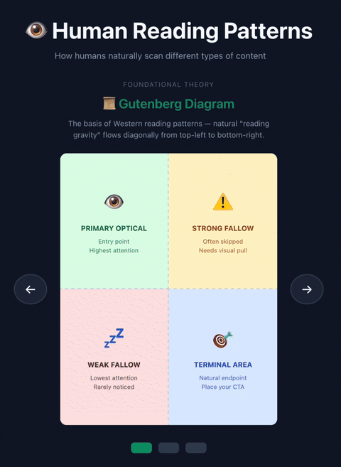

<sub>🧭 **Navigation:**</sub><br>
<sub>[Home](README.md) | 🔵 **Vision LLM Theory** | [Frontend](frontend/FRONTEND_README.md) | [Deployment](deployment/DEPLOYMENT_README.md) | [CDK Stacks](deployment/stacks/STACKS_README.md) | [Runtime](deployment/runtime/RUNTIME_README.md) | [S3 Files](deployment/s3_files/S3_FILES_README.md) | [Lambda Analyzers](deployment/lambdas/LAMBDA_ANALYZERS.md) | [Prompting System](deployment/s3_files/prompts/PROMPTING_SYSTEM_README.md)</sub>

---

# 🧠 Why Vision LLMs? The Theory Behind BADGERS

This document explains the cognitive science and technical foundations that make vision-enabled LLMs superior to traditional OCR for document understanding.

---

## 🚫 The Problem with Traditional OCR

Traditional OCR operates character-by-character and line-by-line without understanding spatial relationships or groupings.

### How OCR Works

```
1. Identify and isolate words
2. Isolate letter contours from contour image
3. Process letters according to trained OCR input
4. Consolidate predictions according to OCR model
5. Identify grid patterns
6. Identify structural groups of words
7. Assign identifiers to groups (columns, headers, sections, etc.)
```

### Where OCR Falls Short

| Challenge                    | Description                                                                                                       |
| ---------------------------- | ----------------------------------------------------------------------------------------------------------------- |
| 🎨 **Visual Complexity**      | Multi-column layouts, overlapping text/images, varying fonts, decorative elements, watermarks create ambiguity    |
| 🏗️ **Hierarchical Structure** | Headers, subheaders, body text, captions, footnotes exist at different levels—OCR treats all text as equal        |
| 🔀 **Reading Flow Ambiguity** | Non-linear paths, text wrapping around images, pull quotes, sidebars—OCR defaults to left-to-right, top-to-bottom |
| 📐 **Formatting Variations**  | Equations, tables, charts, citations, drop caps, stylized fonts confuse character recognition models              |

> 💡 **Key Insight**: OCR reads a table as a random sequence of text rather than recognizing structured rows and columns. It can't tell that a header relates to content below it.

---

## 👁️ How Vision LLMs See Documents

Vision LLMs perceive documents the way humans do—as a **structured whole** where proximity, alignment, and visual patterns create meaning.

### Gestalt Principles: Grouping (Proximity + Similarity)

<p align="center">
  
</p>

**When:** Any visual content with multiple elements.

**Behavior:** The brain automatically organizes elements into groups based on closeness (proximity) and shared attributes like color or shape (similarity). When both principles align, grouping is strongest. When they conflict—close elements with different colors—the brain must choose, often defaulting to proximity.

| Principle           | Human Perception                    | Vision LLM Equivalent                              |
| ------------------- | ----------------------------------- | -------------------------------------------------- |
| 🔲 **Proximity**     | Nearby items feel grouped           | Attention weights cluster spatially close tokens   |
| 🔳 **Similarity**    | Similar elements feel related       | Feature vectors align for visually similar regions |
| ➡️ **Continuity**    | Aligned elements form lines/columns | Sequential attention patterns follow visual flow   |
| 🖼️ **Figure-Ground** | Content separates from background   | Segmentation distinguishes text from decoration    |
| 🔘 **Closure**       | Incomplete shapes feel complete     | Inference fills gaps in partially visible elements |

---

## 📖 Vision Scanning Models

<p align="center">
  
</p>

Eye-tracking research reveals how humans scan layouts. Vision LLMs learn similar scanning strategies.

### Gutenberg Diagram

**When:** Core across all content.

**Behavior:** "Reading gravity" pulls readers from top-left to bottom-right in left-to-right languages. The shortest path is the diagonal line between them. This is constant until content bends the reader's attention away from that line.

### F-Pattern

**When:** Text-heavy pages (articles, blogs, docs).

**Behavior:** Text density while scanning causes fatigue, making each subsequent horizontal scan shorter.

### Z-Pattern

**When:** Visual pages (landing, marketing, ads).

**Behavior:** Zig-zag pattern as key information seeking is rewarded by visually interesting elements.

> 🧠 **Why This Matters**: These patterns arise from the brain's optimization for **information foraging**—maximizing information gain while minimizing effort.

---

## ⚙️ How Vision LLMs Process Documents

<p align="center">
  
</p>

Vision LLMs process images in four distinct phases:

### Phase 1: Grid Overlay
The raw image enters the encoder with a grid overlay showing how it will be divided into processable regions.

### Phase 2: Tokenization
The image is tokenized into patches—each cell becomes a discrete token the model can process.

### Phase 3: Self-Attention
All patches attend to all other patches simultaneously through self-attention. This happens in parallel rather than sequentially like human reading—visualized as a web of connections forming across the entire image at once.

### Phase 4: Semantic Extraction
The strongest semantic relationships emerge from the noise—title connects to image, image to body text, navigation to content—as the model extracts meaning from spatial relationships learned during training.

### Multi-Head Self-Attention

| Attention Pattern          | What It Captures                                   |
| -------------------------- | -------------------------------------------------- |
| 📝 **Heading → Body**       | Heading tokens attend to nearby body text tokens   |
| 🖼️ **Image → Caption**      | Image region tokens attend to adjacent text tokens |
| 📊 **Table Cell → Header**  | Data cells attend to column/row headers            |
| 🔗 **Footnote → Reference** | Footnote markers attend to their source text       |

---

## 🎯 Why This Matters for BADGERS

BADGERS leverages these vision LLM capabilities through specialized analyzers:

| Capability             | Traditional OCR         | Vision LLM (BADGERS)        |
| ---------------------- | ----------------------- | --------------------------- |
| Table extraction       | ❌ Random text sequence  | ✅ Structured rows/columns   |
| Reading order          | ❌ Left-to-right only    | ✅ Follows visual flow       |
| Hierarchy detection    | ❌ All text equal        | ✅ Headers, body, captions   |
| Multi-column layouts   | ❌ Jumbled output        | ✅ Correct column separation |
| Figure-caption linking | ❌ No relationship       | ✅ Semantic association      |
| Complex formatting     | ❌ Confused by equations | ✅ Understands notation      |

---

## 📚 Key Takeaways

1. **🧠 Gestalt perception** enables vision LLMs to see documents as structured wholes, not character sequences

2. **👁️ Attention mechanisms** allow simultaneous analysis of all document regions and their relationships

3. **📖 Reading patterns** (Gutenberg, F, Z) reflect cognitive optimization strategies that vision LLMs learn to emulate

4. **🔗 Cross-modal reasoning** connects visual layout to semantic meaning—headers relate to content, captions describe images

5. **🏗️ Hierarchical processing** builds understanding from pixels → patches → regions → layout → meaning

**💡 Bottom Line**: Vision LLMs don't just read text—they *understand documents* the way humans do.
