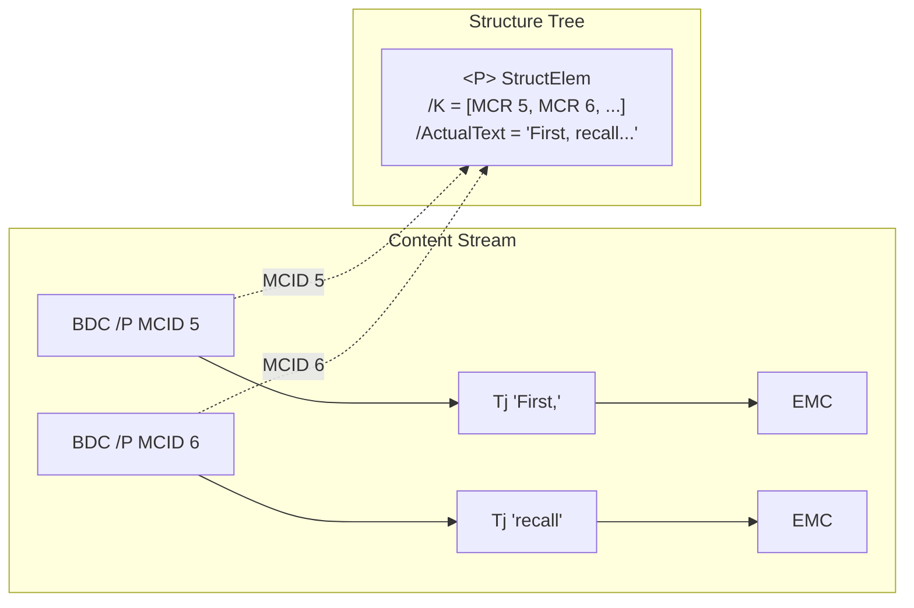
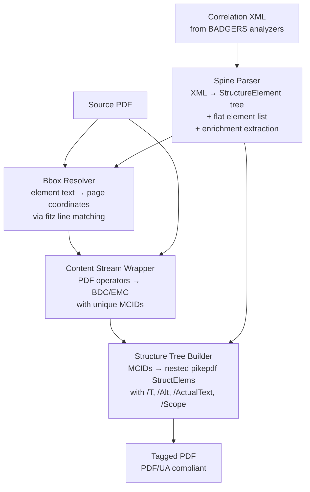
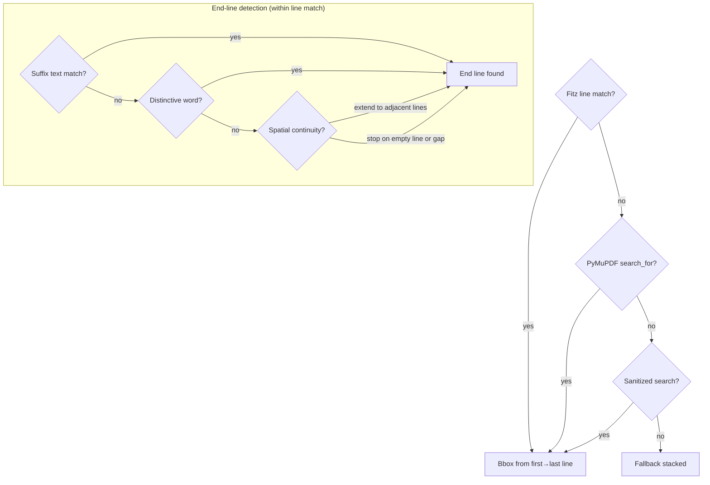
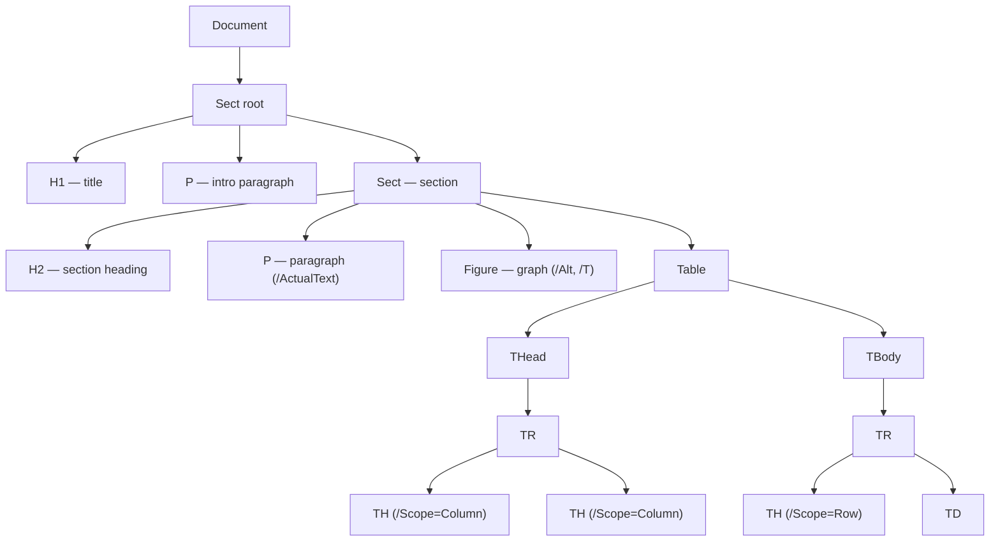

# PDF Accessibility Tagger

Automated PDF/UA remediation pipeline. Takes an untagged PDF and a correlation XML (from the BADGERS analyzer system), and produces a fully tagged accessible PDF with structure tree, alt text, and PDF/UA metadata.

## Why This Works

A PDF has two independent systems:

**Content Stream** — raw drawing instructions (`BT`, `Tj`, `ET`, `Do`) that place glyphs and images at coordinates. No semantic meaning. A paragraph is just a sequence of "draw character X at position Y" commands.

**Structure Tree** — a separate hierarchy that says what the content *means*. `<P>` for paragraphs, `<H1>` for headings, `<Figure>` with `/Alt` for images. Screen readers read this, not the content stream.

They're connected by **MCIDs** (Marked Content IDs). In the content stream, operators are wrapped in `BDC`/`EMC` pairs carrying an MCID number. In the structure tree, each element's `/K` array points to those MCIDs. Acrobat follows the links to connect meaning to pixels.



A screen reader sees one `<P>` and reads the full paragraph as a single unit, regardless of how many MCIDs it contains.

## Pipeline




## Stage 1: Spine Parser

Reads the unified_document XML (badgers schema v1.0) and produces:

1. **StructureElement tree** — hierarchical Document → Sect → H1/P/Table/Figure nodes that mirror the PDF/UA structure tree. Tables have full substructure (THead → TR → TH/TD with scope). Lists have L → LI → Lbl + LBody.

2. **Flat element list** — each leaf element with `id`, `type`, `tag`, `text`, `order`, and enrichment data. This feeds the bbox resolver.

3. **Enrichment extraction** — normalizes all analyzer-specific enrichment blocks (chart, table, diagram, war_map, code_block, handwriting, handwriting_math, decision_tree) into a uniform `{title, description, actual_text, tags, related}` dict per element.

## Stage 2: Bbox Resolver

Finds where each element's text lives on the PDF page. This is the hardest stage because PDF content streams encode text differently than how it appears visually.



Key problems solved:

- **Fitz groups multiple paragraphs into one block** — we match at the line level, not block level. Each fitz line has its own bbox.
- **Special characters** (subscripts ₀₁, middle dot ·, en dash –, curly quotes "") — `_sanitize_for_search()` strips to ASCII for matching.
- **Long paragraphs** — find start line via text prefix, find end line via suffix/word/spatial continuity. Bounded by `max_lines = text_length / 40` to prevent bleeding into the next element.
- **Paragraph boundaries** — spatial continuity stops on empty fitz lines (the blank line between paragraphs).
- **Overlapping bboxes** — prevented by the max-lines bound and empty-line detection.

## Stage 3: Content Stream Wrapper

Walks the PDF's raw content stream operators and wraps each text/image operator in `BDC`/`EMC` with a unique MCID, spatially matched to the correct element region.

The wrapper:
1. Strips any existing marked content (`BMC`/`BDC`/`EMC`)
2. Tracks the current coordinate matrix (`cm`) to know where each operator draws
3. For text operators (`Tj`/`TJ`): converts `cm` y-position to fitz coordinates, finds the matching fitz line, finds the region whose bbox overlaps that line
4. For image operators (`Do`): computes the image bbox from the `cm` matrix, finds the matching Figure region
5. Closes `BDC` before `ET` (Acrobat requirement — marked content must nest inside text objects)

### Why Per-Word MCIDs Are Unavoidable

Different PDF authoring tools produce different levels of content stream fragmentation:

| Authoring Tool    | Content Stream Style    | MCIDs per Paragraph |
| ----------------- | ----------------------- | ------------------- |
| Microsoft Word    | One BT/ET per word      | ~50-100             |
| LaTeX             | One BT/ET per line      | ~5-10               |
| Scanned + OCR     | One BT/ET per word      | ~50-100             |
| Some legacy tools | One BT/ET per character | ~200+               |

We cannot merge BT/ET blocks because each has its own coordinate transform matrix. We cannot span BDC/EMC across BT/ET boundaries because Acrobat rejects it (despite the PDF spec allowing it). Each MCID must be unique.

The solution: one MCID per text operator, grouped under one StructElem in the structure tree. A paragraph with 50 word-fragments gets 50 MCIDs, but the Tags panel shows one `<P>` with 50 MCR children. Screen readers read it as one paragraph. The visual noise in Acrobat's content panel is cosmetic.

## Stage 4: Structure Tree Builder

Two modes:

**Hierarchical** (when spine_parser provides a StructureElement tree): walks the tree depth-first and produces nested pikepdf StructElems mirroring the hierarchy. Tables get THead → TR → TH (with `/Scope`) → TD. Figures get `/Alt`. Container elements get enrichment data (`/T`, `/ActualText`).

**Flat** (fallback): groups MCIDs by element_id into a flat Document → StructElems list.




### Enrichments on Container Elements

Enrichment data attaches at the container level only. Leaf elements (TH, TD, P inside LBody) carry raw text.

| PDF Attribute     | Source                                                         | Applied To                              |
| ----------------- | -------------------------------------------------------------- | --------------------------------------- |
| `/T` (Title)      | `enrichment_title` — chart title, table caption, code language | Table, Figure, Code containers          |
| `/Alt` (Alt Text) | `enrichment_description` or `alt_text`                         | Figure elements                         |
| `/ActualText`     | `enrichment_actual_text` — data series, node list, outcomes    | Container elements with structured data |
| `/A /Scope`       | `scope` attribute from XML                                     | TH elements (Column or Row)             |
| `/Lang`           | Document-level `en-US`                                         | Catalog                                 |

### Multi-Page Handling

Content streams are wrapped per-page. All MCIDs across all pages are merged into one `merged_mcid_map`, then a single `build_structure_tree` call produces one StructTreeRoot for the entire document. Each MCR's `/Pg` reference points to the correct page object via `TagRegion.page`.

### UTF-16BE Encoding

Some PDFs store text as UTF-16BE (BOM `0xFEFF` + null-interleaved bytes). `_clean_text_for_pdf()` in `structure_tree.py` detects the BOM as Unicode codepoints (`\u00fe\u00ff`), decodes via `latin-1 → utf-16-be`, and strips nulls. `pdf_tag_panel.py`'s `_str_val()` does the same when reading back from the saved PDF.

### PDF/UA Metadata

The tagged PDF includes:
- `/StructTreeRoot` with `/RoleMap` (Artifact → NonStruct)
- `/MarkInfo` with `/Marked = true`
- `/Lang = en-US` on the catalog
- `/ViewerPreferences /DisplayDocTitle = true`
- `/Tabs = /S` on every page (structure-order tab navigation)
- `/StructParents` on every page
- XMP metadata: `dc:title`, `dc:language`, `pdfuaid:part = 1`

## Syntax Repair

Before tagging, the pipeline optionally runs a two-pass syntax repair:

1. **Pass 1 (PyMuPDF)**: `doc.save(clean=True, garbage=4)` — cleans content streams, deduplicates objects
2. **Pass 2 (pikepdf)**: `pdf.save(linearize=True, object_stream_mode=generate)` — rebuilds xref table, normalizes object streams

Each pass is fault-tolerant. Controlled by `ENABLE_SYNTAX_REPAIR` env var (default: true).

## Debug Tools

| Tool                   | Purpose                                       | Usage                                              |
| ---------------------- | --------------------------------------------- | -------------------------------------------------- |
| `bbox_visualizer.py`   | Overlay resolved bboxes on page image         | `visualize_bboxes(pdf_path, resolved, page_idx=0)` |
| `pdf_content_panel.py` | Dump content stream marked content tree       | `view(pdf_path)` or `save(pdf_path)`               |
| `pdf_tag_panel.py`     | Dump structure tree hierarchy with attributes | `view(pdf_path)` or `save(pdf_path)`               |

## Container Deployment

`container/` has a complete Lambda container setup:
- `Dockerfile` — Lambda Python 3.12 base, pikepdf/PyMuPDF/Pillow/boto3
- `lambda_handler.py` — S3 download → pipeline → S3 upload, same event schema as the old remediation_analyzer
- `build.sh` — builds Docker image, pushes to ECR, updates Lambda function. Auto-copies shared modules (`spine_parser.py`, `pdf_accessibility_models.py`, `pdf_syntax_repair.py`) and `utils/` into the build context.

## File Map

```
final_form/
├── main.py                    # CLI entry point
├── tagger.ipynb               # Interactive notebook
├── README.md                  # This file
├── ARCHITECTURE.md            # Mermaid diagrams of internals
├── container/                 # Lambda container deployment
│   ├── Dockerfile
│   ├── build.sh
│   ├── lambda_handler.py
│   ├── requirements.txt
│   └── .dockerignore
├── utils/
│   ├── __init__.py
│   ├── spine_parser.py        # XML → StructureElement tree + flat elements + enrichments
│   ├── bbox_resolver.py       # Element text → page coordinates (line-level matching)
│   ├── content_stream.py      # PDF operators → BDC/EMC marked content
│   ├── structure_tree.py      # MCIDs → nested pikepdf StructElems
│   ├── tag_mapping.py         # Correlation types → PDF/UA tags (full set)
│   ├── pdf_content_panel.py   # Debug: content stream viewer
│   ├── pdf_tag_panel.py       # Debug: structure tree viewer
│   ├── bbox_visualizer.py     # Debug: bbox overlay on page image
│   └── pdf_accessibility_models.py  # TagRegion, StructureElement, VALID_TAGS
├── inputs/                    # Test fixtures
│   ├── ECON320/               # Real-world test PDF + correlation XML
│   ├── unified_output_sample.xml   # Synthetic all-analyzer sample
│   ├── unified_output_sample.pdf   # Generated test PDF from sample
│   └── generate_test_pdf.py        # Generates test PDF from sample XML
└── outputs/                   # Tagged PDFs + debug panels
    └── panel/                 # Content/tag panel JSON exports
```
