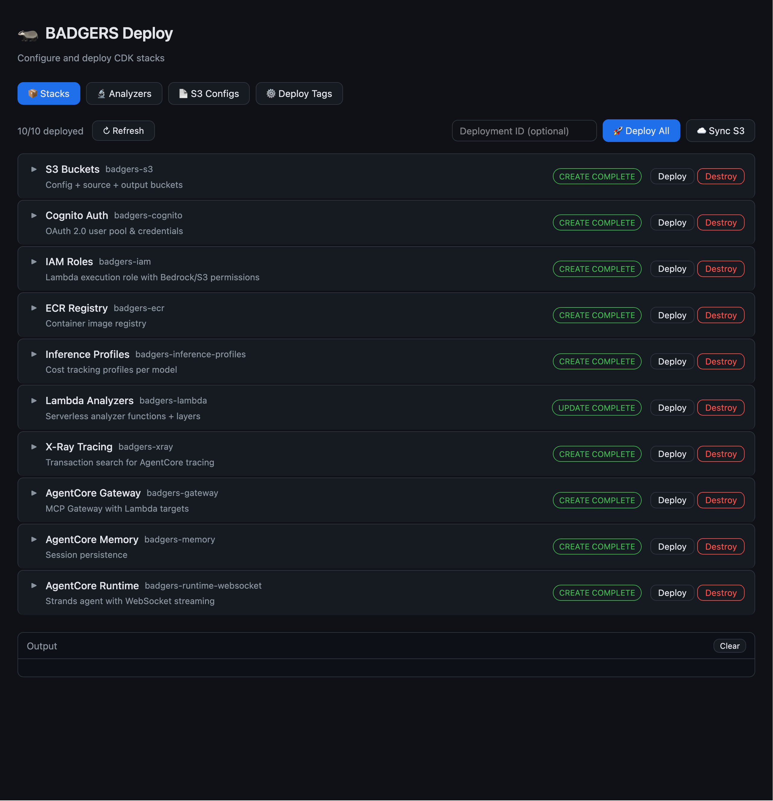
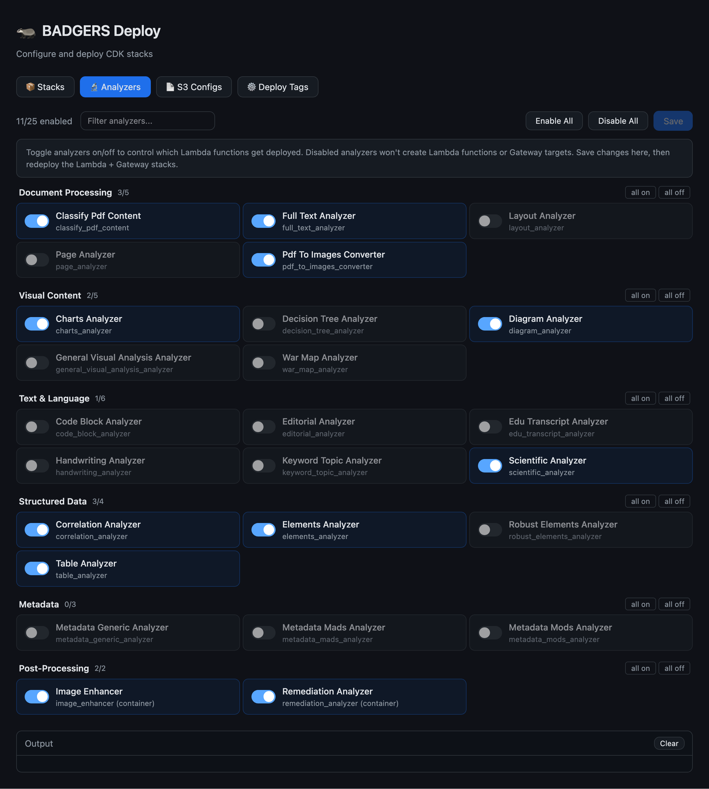
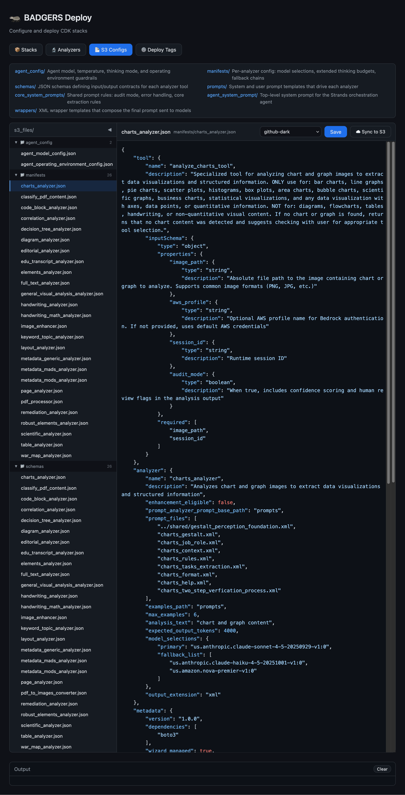
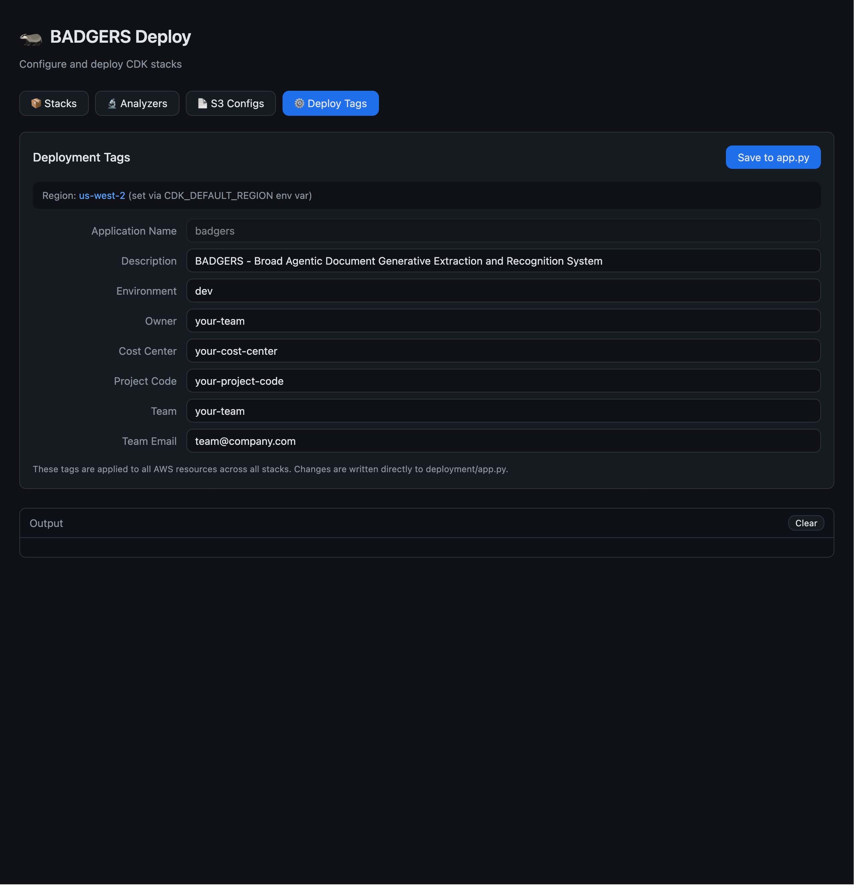

<sub>🧭 **Navigation:**</sub><br>
<sub>[Home](../../README.md) | [Vision LLM Theory](../../VISION_LLM_THEORY_README.md) | [Local Testing](../../local_testing/LOCAL_TESTING_README.md) | 🔵 **Deployment UI** | [Deployment](../DEPLOYMENT_README.md) | [CDK Stacks](../stacks/STACKS_README.md) | [Runtime](../runtime/RUNTIME_README.md) | [S3 Files](../s3_files/S3_FILES_README.md) | [Lambda Analyzers](../lambdas/LAMBDA_ANALYZERS.md) | [Prompting System](../s3_files/prompts/PROMPTING_SYSTEM_README.md)</sub>

---

# 🚀 BADGERS Deployment UI

React + Express application for managing CDK stack deployments, analyzer configurations, and S3 config files through a visual interface. Provides a GUI alternative to running CDK commands directly.

## Quick Start

```bash
cd deployment/ui
npm install    # first time only
npm run dev    # starts Express server on port 3456, Vite on port 5173
```

| Service | URL                   |
| ------- | --------------------- |
| UI      | http://localhost:5173 |
| API     | http://localhost:3456 |

## Screenshots

| Stack Information                                                                 | Analyzer Deployables                                                                    |
| --------------------------------------------------------------------------------- | --------------------------------------------------------------------------------------- |
|  |  |

| Config Editor                                                             | Tagging                                                       |
| ------------------------------------------------------------------------- | ------------------------------------------------------------- |
|  |  |

## Tabs

| Tab           | Purpose                                                                   |
| ------------- | ------------------------------------------------------------------------- |
| 📦 Stacks      | View, deploy, and destroy individual CDK stacks with streaming log output |
| 🔬 Analyzers   | Browse and select analyzer configurations                                 |
| 📄 S3 Configs  | Edit S3-hosted configuration files (manifests, prompts, schemas)          |
| ⚙️ Deploy Tags | Edit deployment tags applied to CDK stacks                                |

## Architecture

```
Browser (React/Vite)
    │
    ├── /api/* ──→ Express server (port 3456)
    │                ├── CDK deploy/destroy (SSE streaming)
    │                ├── Stack status queries
    │                ├── S3 config file read/write
    │                └── Deployment tag management
    │
    └── Static assets (Vite dev server, port 5173)
```

The Express server executes CDK CLI commands as child processes and streams stdout/stderr back to the browser via Server-Sent Events (SSE). Long-running deployments (up to 1 hour) are supported via extended proxy timeouts.

## Tech Stack

| Component         | Technology               |
| ----------------- | ------------------------ |
| Frontend          | React 19, Vite 6         |
| Backend           | Express 5, Node.js       |
| Code highlighting | highlight.js             |
| Streaming         | Server-Sent Events (SSE) |

## Project Structure

```
deployment/ui/
├── src/
│   ├── App.jsx                  # Tab router
│   ├── main.jsx                 # React entry point
│   ├── index.css                # Global styles
│   └── components/
│       ├── StackList.jsx        # CDK stack deploy/destroy
│       ├── AnalyzerSelector.jsx # Analyzer browser
│       ├── S3ConfigEditor.jsx   # S3 config file editor
│       ├── ConfigEditor.jsx     # Deployment tag editor
│       ├── JsonHighlighter.jsx  # JSON syntax highlighting
│       ├── Header.jsx           # App header
│       └── LogPanel.jsx         # Streaming log output
├── server/
│   └── index.js                 # Express API server
├── package.json
└── vite.config.js
```
