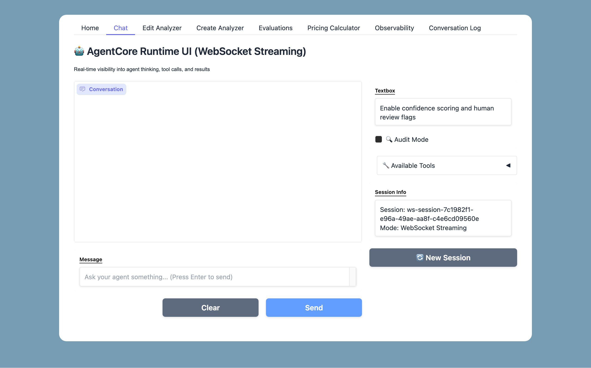
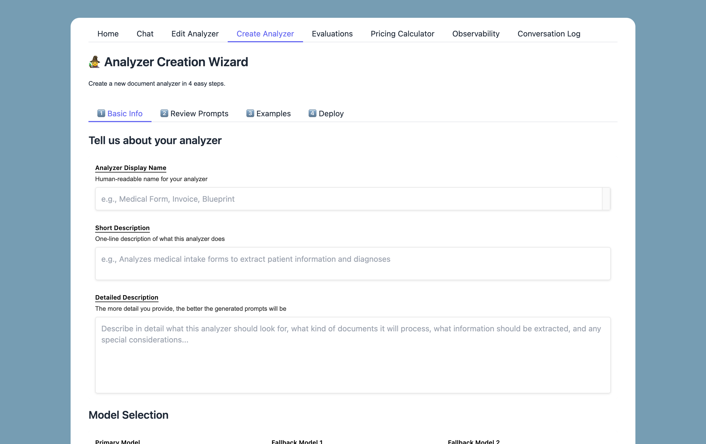
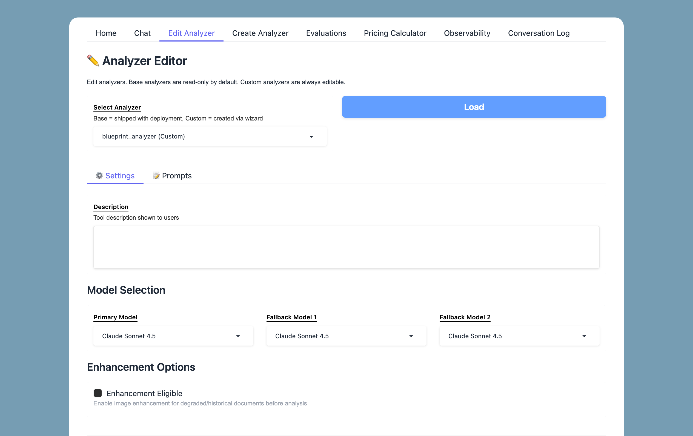
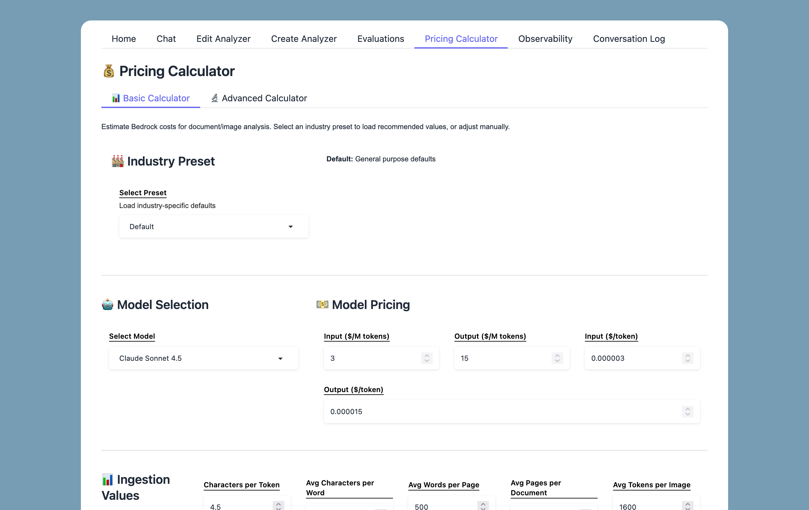
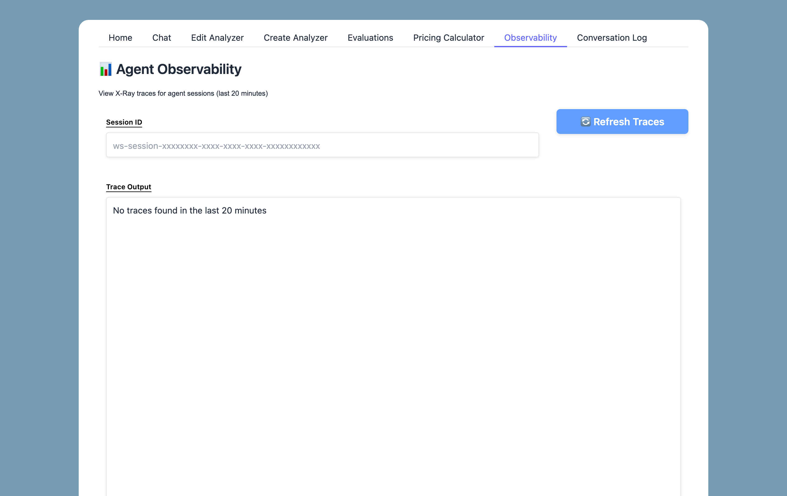
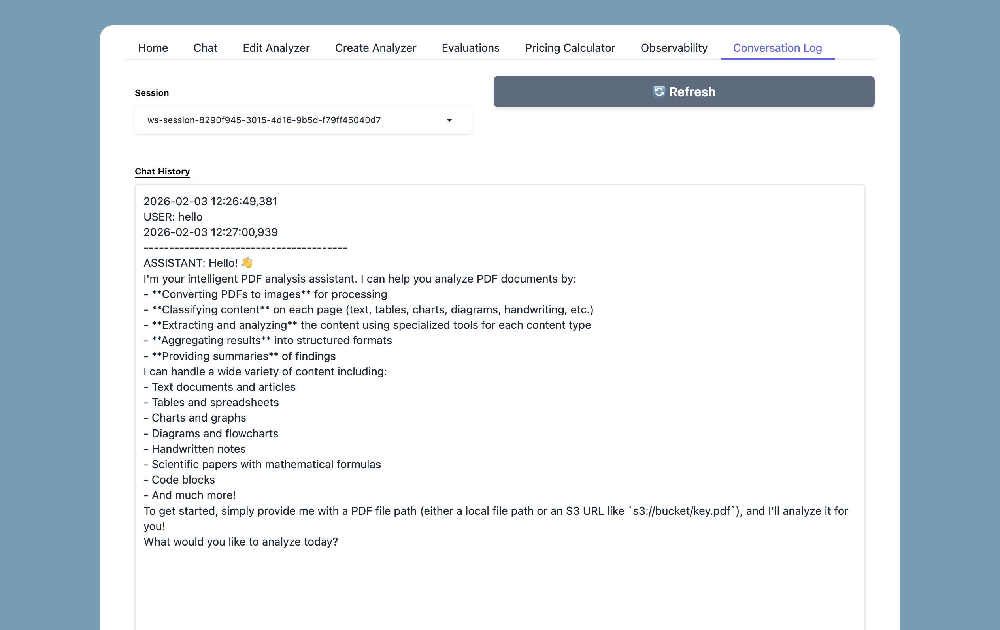

<sub>🧭 **Navigation:**</sub><br>
<sub>[Home](../README.md) | [Vision LLM Theory](../VISION_LLM_THEORY_README.md) | 🔵 **Frontend** | [Deployment](../deployment/DEPLOYMENT_README.md) | [CDK Stacks](../deployment/stacks/STACKS_README.md) | [Runtime](../deployment/runtime/RUNTIME_README.md) | [S3 Files](../deployment/s3_files/S3_FILES_README.md) | [Lambda Analyzers](../deployment/lambdas/LAMBDA_ANALYZERS.md) | [Prompting System](../deployment/s3_files/prompts/PROMPTING_SYSTEM_README.md) | [Pricing Calculator](PRICING_CALCULATOR.md)</sub>

---

# 🖥️ BADGERS Frontend

A Gradio-based chat interface for interacting with the AgentCore Runtime. Upload PDFs, send analysis requests, and view agent responses with extended thinking visualization.



---

## ✨ Features

| Feature                  | Description                                                  |
| ------------------------ | ------------------------------------------------------------ |
| 💬 **Chat Interface**     | WebSocket streaming chat with message history                |
| 🧠 **Thinking Display**   | Collapsible reasoning blocks from Claude's extended thinking |
| 📤 **PDF Upload**         | Upload PDFs directly to S3 for analysis                      |
| 🔧 **Tool Discovery**     | Lists available analyzer tools from Gateway                  |
| 📊 **Session Tracking**   | Maintains conversation context across messages               |
| 🧙 **Analyzer Wizard**    | Create custom analyzers via guided UI                        |
| ✏️ **Analyzer Editor**    | Edit existing analyzer prompts and configuration             |
| 💰 **Pricing Calculator** | Estimate Bedrock costs with document presets                 |
| 📈 **Observability**      | View agent execution traces and tool calls                   |
| 📝 **Conversation Log**   | Review full conversation history with thinking blocks        |
| 🧪 **Result Evaluator**   | Evaluate analyzer output quality with Likert scoring         |

> [!TIP]
> See [Analyzer Wizard](ANALYZER_CREATION_WIZARD.md) for creating custom analyzers.
> See [Pricing Calculator](PRICING_CALCULATOR.md) for cost estimation.

### Analyzer Wizard

Create custom analyzers through a guided UI:



### Analyzer Editor

Edit existing analyzer prompts and configuration:



### Pricing Calculator

Estimate Bedrock costs with document presets:



---

## 🚀 Quick Start

### 1️⃣ Install Dependencies

```bash
cd frontend
pip install -r requirements.txt
```

Or with uv:
```bash
uv pip install -r requirements.txt
```

### 2️⃣ Configure Environment

Copy the sample and fill in your values:
```bash
cp .env-sample .env
```

Or run the auto-config script after deployment:
```bash
cd ../deployment
./update_frontend_env.sh
```

> [!TIP]
> The `update_frontend_env.sh` script automatically populates `.env` from CloudFormation stack outputs.

### 3️⃣ Run the UI

```bash
uv run python main.py
```

Open http://localhost:7860 in your browser.

The app launches as a multi-page Gradio interface with tabs for Chat, Analyzer Editor, Analyzer Creator, Evaluations, Pricing Calculator, Observability, and Conversation Log.

---

## ⚙️ Environment Variables

### Required

| Variable                          | Description                                   |
| --------------------------------- | --------------------------------------------- |
| `AWS_REGION`                      | AWS region (e.g., `us-west-2`)                |
| `AGENTCORE_RUNTIME_WEBSOCKET_ARN` | ARN of deployed AgentCore Runtime (WebSocket) |
| `AGENTCORE_GATEWAY_ID`            | Gateway ID for tool discovery                 |
| `S3_UPLOAD_BUCKET`                | S3 bucket for PDF uploads                     |
| `S3_OUTPUT_BUCKET`                | S3 bucket for analysis results                |
| `S3_CONFIG_BUCKET`                | S3 bucket for analyzer configs                |

### Timeouts

| Variable                    | Default | Description                                 |
| --------------------------- | ------- | ------------------------------------------- |
| `AGENTCORE_READ_TIMEOUT`    | `600`   | Seconds to wait for agent response (10 min) |
| `AGENTCORE_CONNECT_TIMEOUT` | `30`    | Seconds to wait for connection              |
| `AGENTCORE_MAX_RETRIES`     | `1`     | Retry attempts (1 = no retries)             |

> [!WARNING]
> Keep `AGENTCORE_MAX_RETRIES=1` to prevent duplicate invocations and conversation corruption.

### Control Plane (Tool Discovery)

| Variable                                  | Default | Description                   |
| ----------------------------------------- | ------- | ----------------------------- |
| `AGENTCORE_CONTROL_PLANE_READ_TIMEOUT`    | `30`    | Timeout for listing tools     |
| `AGENTCORE_CONTROL_PLANE_CONNECT_TIMEOUT` | `10`    | Connection timeout            |
| `AGENTCORE_CONTROL_PLANE_MAX_RETRIES`     | `3`     | Retries for control plane ops |

---

## 🎨 UI Components

```
+-------------------------------------------------------------+
|  AgentCore Runtime UI                                       |
+-------------------------------------------------------------+
|  Upload PDF to S3 (collapsible)                             |
|  +-------------------------------------------------------+  |
|  | [Select PDF]                    [Upload to S3]        |  |
|  +-------------------------------------------------------+  |
+-------------------------------------------------------------+
|  +-----------------------------+ +-----------------------+  |
|  |                             | | Connectivity          |  |
|  |      Chat History           | | [x] Connected         |  |
|  |                             | +-----------------------+  |
|  |  User: Analyze this PDF...  | | Available Tools       |  |
|  |                             | | - full_text_analyzer  |  |
|  |  Agent:                     | | - table_analyzer      |  |
|  |  <thinking>...</thinking>   | | - chart_analyzer      |  |
|  |  Here's the analysis...     | | ...                   |  |
|  |                             | +-----------------------+  |
|  |                             | | Session Info          |  |
|  |                             | | ID: ui-session-xxx    |  |
|  |                             | | Timeout: 600s         |  |
|  +-----------------------------+ +-----------------------+  |
|  +-------------------------------------------------------+  |
|  | [Message input...]              [Send] [Clear Chat]   |  |
|  +-------------------------------------------------------+  |
+-------------------------------------------------------------+
```

---

## 📁 Directory Structure

```
frontend/
├── main.py                 # 🖥️ Multi-page Gradio app entry point
├── pages/                  # 📄 UI page modules
│   ├── home.py             # 🏠 Landing page
│   ├── agent_chat_websocket.py # 💬 WebSocket streaming chat
│   ├── analyzer_editor.py  # ✏️ Edit analyzer prompts
│   ├── analyzer_wizard.py  # 🧙 Create custom analyzers
│   ├── result_evaluator.py # 🧪 Evaluate analyzer output quality
│   ├── pricing_calculator.py # 💰 Cost estimation tool
│   ├── agent_observability.py # 📈 Execution traces and tool calls
│   └── chat_log.py         # 📝 Conversation history viewer
├── config/                 # ⚙️ Configuration files
│   └── pricing_config.json
├── css/                    # 🎨 Custom styles
│   └── custom_style.css
├── prompts_wizard/         # 📝 Wizard prompt templates
├── images/                 # 🖼️ Avatar and logo images
├── requirements.txt        # 📦 Python dependencies
├── .env                    # ⚙️ Environment configuration (create from .env-sample)
├── .env-sample             # 📋 Template for environment variables
└── logs/                   # 📊 Application logs
    └── main.log
```

---

## 📝 Usage Examples

### Analyze a PDF

1. Expand "📤 Upload PDF to S3"
2. Select your PDF file
3. Click "Upload to S3"
4. Copy the S3 URI from the result
5. Send a message like:

```
Analyze the document at s3://my-bucket/document.pdf and extract all tables
```

### Multi-Step Analysis

```
1. First, convert s3://bucket/report.pdf to images
2. Then extract all text from page 1
3. Finally, analyze any charts on page 2
```

The agent orchestrates multiple tools automatically based on your request.

---

## 🔍 Logs

Logs are written to `frontend/logs/main.log` and stdout:

```bash
tail -f logs/main.log
```

Log entries include:
- 🔌 Client initialization
- 📤 S3 uploads
- 🤖 Runtime invocations with timing
- ❌ Errors with stack traces

### Agent Observability

View detailed agent execution traces and tool calls:



### Conversation Log

Review full conversation history with thinking blocks:



---

## 🛠️ Troubleshooting

| Issue                           | Solution                                                 |
| ------------------------------- | -------------------------------------------------------- |
| "Runtime client not configured" | Check `.env` has valid `AGENTCORE_RUNTIME_WEBSOCKET_ARN` |
| "Request timed out"             | Increase `AGENTCORE_READ_TIMEOUT` in `.env`              |
| "Failed to connect"             | Verify AWS credentials and region                        |
| No tools listed                 | Check `AGENTCORE_GATEWAY_ID` matches deployment          |
| Upload fails                    | Verify `S3_UPLOAD_BUCKET` and IAM permissions            |
