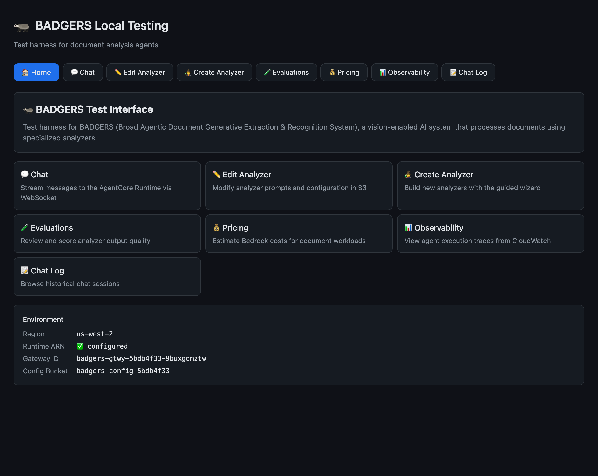
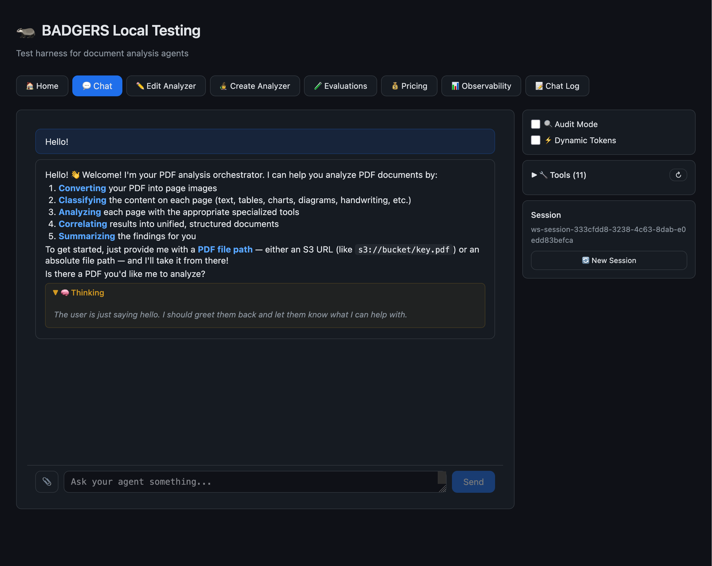
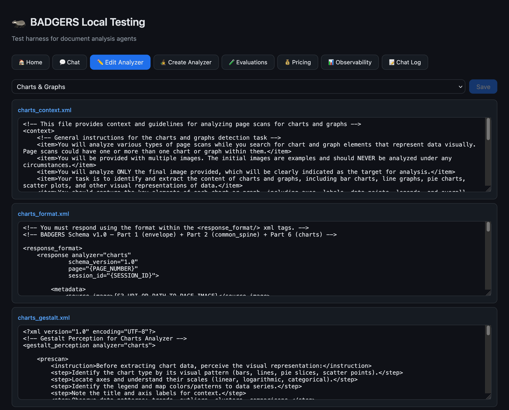
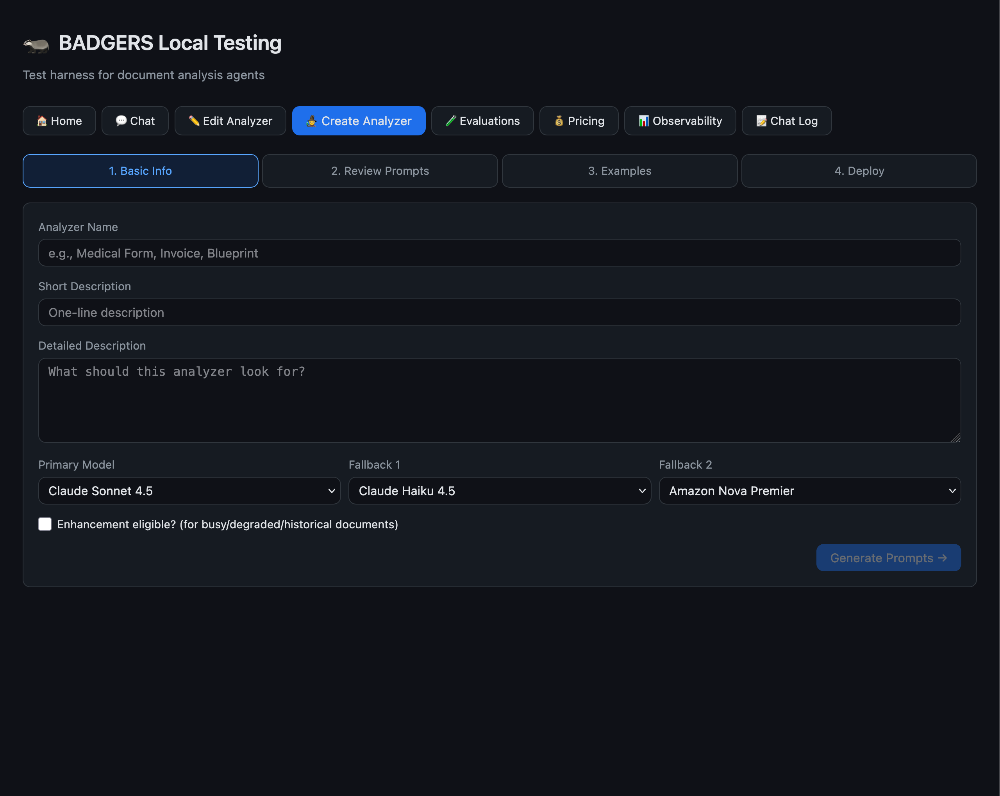
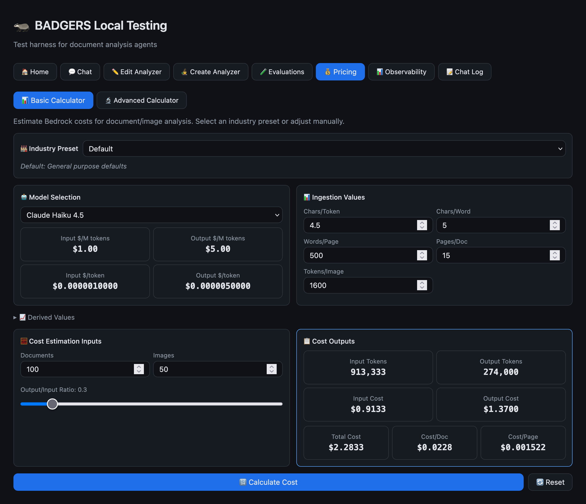
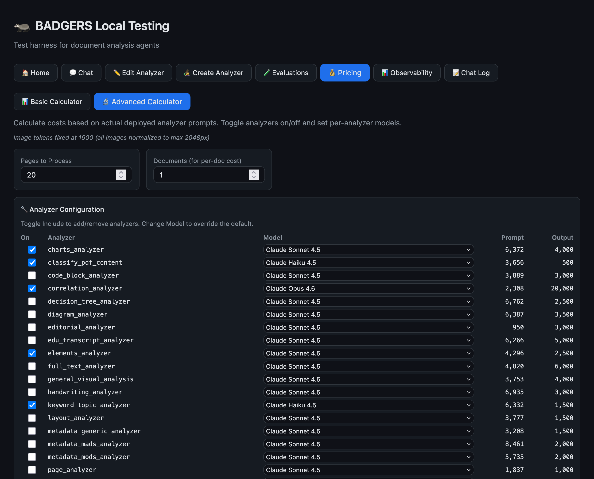
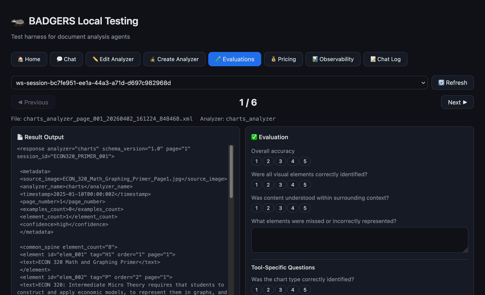
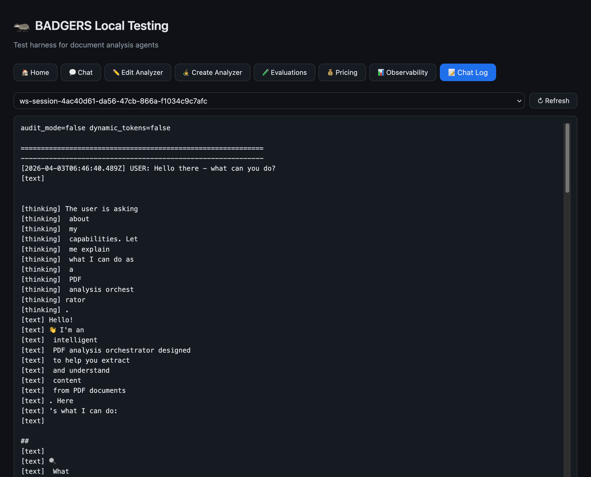
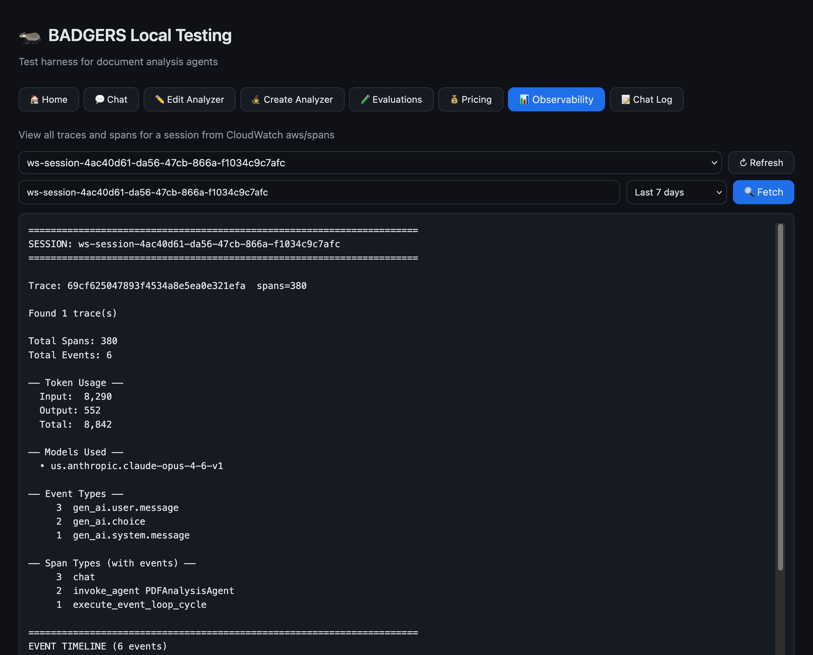

<sub>🧭 **Navigation:**</sub><br>
<sub>[Home](../README.md) | [Vision LLM Theory](../VISION_LLM_THEORY_README.md) | 🔵 **Local Testing** | [Deployment UI](../deployment/ui/DEPLOYMENT_UI_README.md) | [Deployment](../deployment/DEPLOYMENT_README.md) | [CDK Stacks](../deployment/stacks/STACKS_README.md) | [Runtime](../deployment/runtime/RUNTIME_README.md) | [S3 Files](../deployment/s3_files/S3_FILES_README.md) | [Lambda Analyzers](../deployment/lambdas/LAMBDA_ANALYZERS.md) | [Prompting System](../deployment/s3_files/prompts/PROMPTING_SYSTEM_README.md)</sub>

---

# 🧪 BADGERS Local Testing UI

React + Express application for local development and testing against a deployed BADGERS backend. Replaces the previous Gradio-based frontend with a faster, more capable interface.

## Quick Start

```bash
cd local_testing
npm install    # first time only
npm run dev    # starts Vite (5174) + Express API (3457)
```

Or use the convenience script:

```bash
./start.sh
```

| Service | URL                   |
| ------- | --------------------- |
| UI      | http://localhost:5174 |
| API     | http://localhost:3457 |

## Configuration

Copy and edit the environment file:

```bash
cp config/.env.example config/.env
```

The `.env` file configures AWS credentials, AgentCore endpoints, and S3 bucket names used by the Express server to proxy requests to the deployed backend.

## Screenshots

| Home                                                                  | Chat                                                                  |
| --------------------------------------------------------------------- | --------------------------------------------------------------------- |
|  |  |

| Edit Analyzer                                                                 | Create Analyzer                                                                   |
| ----------------------------------------------------------------------------- | --------------------------------------------------------------------------------- |
|  |  |

| Pricing Calculator (Simple)                                                                | Pricing Calculator (Advanced)                                                                  |
| ------------------------------------------------------------------------------------------ | ---------------------------------------------------------------------------------------------- |
|  |  |

| Evaluations                                                               | Chat Log                                                            |
| ------------------------------------------------------------------------- | ------------------------------------------------------------------- |
|  |  |

| Observability                                                                 |
| ----------------------------------------------------------------------------- |
|  |

## Tabs

| Tab               | Purpose                                                                                   |
| ----------------- | ----------------------------------------------------------------------------------------- |
| 🏠 Home            | Dashboard and quick navigation                                                            |
| 💬 Chat            | Interactive agent chat with document upload — connects to AgentCore Runtime via WebSocket |
| ✏️ Edit Analyzer   | Edit analyzer manifests, prompts, and schemas in-place                                    |
| 🧙 Create Analyzer | Wizard for scaffolding new custom analyzers (prompts, manifest, schema, Lambda handler)   |
| 🧪 Evaluations     | Run and compare analyzer outputs against test documents                                   |
| 💰 Pricing         | Cost estimation calculator with industry presets (insurance, legal, academic, etc.)       |
| 📊 Observability   | CloudWatch Logs Insights queries for agent session monitoring                             |
| 📝 Chat Log        | Browse and review saved chat session logs                                                 |

## Architecture

```
Browser (React/Vite)
    │
    ├── /api/* ──→ Express server (port 3457)
    │                ├── AgentCore WebSocket proxy (chat)
    │                ├── S3 file operations (manifests, prompts, schemas)
    │                ├── CDK deploy commands (SSE streaming)
    │                └── CloudWatch Logs Insights queries
    │
    └── Static assets (Vite dev server, port 5174)
```

## Tech Stack

| Component         | Technology                                          |
| ----------------- | --------------------------------------------------- |
| Frontend          | React 19, Vite 6                                    |
| Chat UI           | @assistant-ui/react                                 |
| Backend           | Express 5, Node.js                                  |
| Code highlighting | react-shiki, highlight.js                           |
| Markdown          | react-markdown                                      |
| AWS SDK           | @aws-sdk/client-s3, @aws-sdk/client-cloudwatch-logs |
| WebSocket         | ws (AgentCore Runtime connection)                   |

## Project Structure

```
local_testing/
├── src/
│   ├── App.jsx                    # Tab router
│   ├── main.jsx                   # React entry point
│   ├── index.css                  # Global styles
│   └── components/
│       ├── Home.jsx               # Dashboard
│       ├── Chat.jsx               # Agent chat interface
│       ├── AnalyzerEditor.jsx     # Manifest/prompt editor
│       ├── AnalyzerWizard.jsx     # New analyzer wizard
│       ├── Evaluator.jsx          # Test runner
│       ├── PricingCalculator.jsx  # Cost estimator
│       ├── Observability.jsx      # CloudWatch queries
│       ├── ChatLog.jsx            # Session log viewer
│       ├── Header.jsx             # App header
│       └── LogPanel.jsx           # Streaming log output
├── server/
│   └── index.js                   # Express API server
├── config/
│   ├── .env                       # Environment variables
│   └── pricing_config.json        # Pricing presets and defaults
├── logs/
│   └── chat_sessions/             # Saved chat transcripts
├── package.json
├── vite.config.js
└── start.sh                       # Convenience launcher
```
